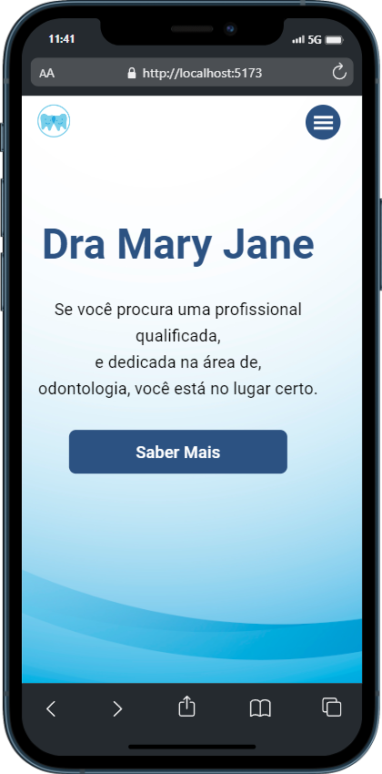

<div align="center" id="top">
  <h1>🚧 Construção 🚧</h1>
</div>

<br />
<div align="center" id='topo'>
  <a href="https://github.com/othneildrew/Best-README-Template">
    
  </a>

  <h3 align="center">SociaLinks</h3>

  <p align="center">
    <br />
    <a href="" target="_blank" rel="noreferrer">Demo do projeto</a>
  </p>
</div>


## Sobre o Projeto
<br />
<!--[![Screen Shot][product-screenshot]](/mobile.png)
[![Screen Shot][product-screenshot]](/pc.png)-->
<div align="center">
  <br />
  <br />
  <!-- -->
</div>
<br />

<br />Sobre o aplicativo:<br />
<br />

- Modelo de um Social Links

<p align="right">(<a href="#topo">Para o topo</a>)</p>


### Desenvolvido com :

<a href="https://reactjs.org/" target="_blank" rel="noreferrer">  </a>


<!-- GETTING STARTED -->
## Iniciar

1. Clonar o repo
   ```sh
   git clone https://github.com/ElvisFelix-dev/model-page-dentist
   ```
2. Abra a pasta
   ```sh
   cd model-page-dentist

3. Instalando NPM packages
   ```sh
   npm install
   ```

4. Iniciar
   ```sh
   npm run dev
   ```

<p align="right">(<a href="#topo">Para o topo</a>)</p>


<!-- CONTACT -->
## Contato

<p align="center"><a href="https://www.linkedin.com/in/elvis-felix" target="blank"></a></p>


<p align="right">(<a href="#topo">Para o topo</a>)</p>
